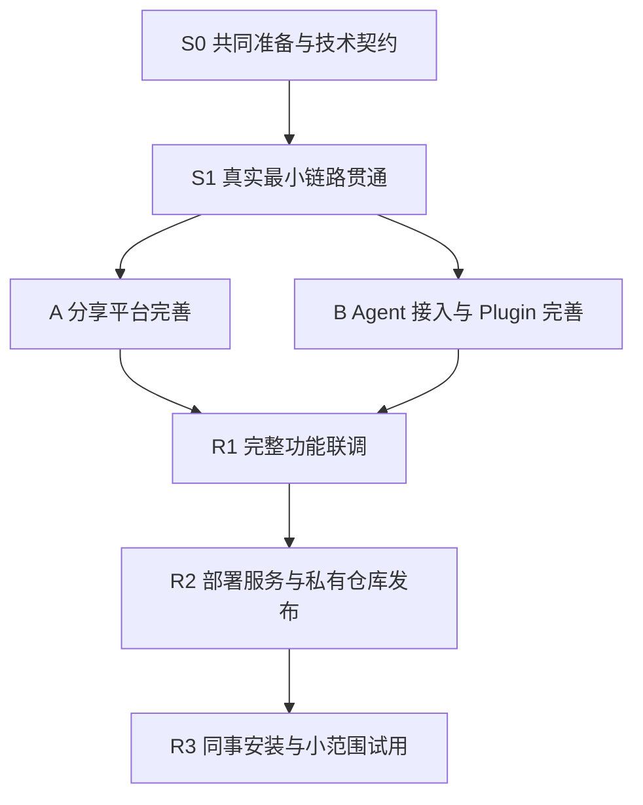

# Sharing — 开发计划与 Plugin 私有分发方案

> 2026-09-29 更新：YouTube Worker 改为直接 URL、Gemini 非流式一次调用，长视频降低画面采样；新迁移记录缓存用量，旧音频摘要和历史计量保留。当前实现及验收边界见 [视频 Worker](./YOUTUBE_AUDIO_WORKER.md)。

版本：v0.6

日期：2026-09-28

状态：A1–A5 与 URL 非流式视频修订代码已实现；生产旧音频镜像尚未升级，当前验收见 URL 记录

关联：[PRD](./PRD.md) · [技术设计](./TECHNICAL_DESIGN.md) · [开发指南](./DEVELOPMENT.md)

## 1. 已确定的实施方式

开发分成两个大任务：**A 分享平台**和 **B Agent 接入与 Plugin**。两者之前安排共同准备与最小链路验证，之后进行完整联调和小范围试用。

第一条必须贯通的链路是：

> 同事用公司 Google 账号登录网页 → 提交链接 → 分享记录入库 → 同一同事在 Agent 中授权 → 查询到分享者、分享时间和原始链接。

这条链路不依赖文章抓取、摘要模型或 YouTube API。先验证真实身份、权限、数据和接口，再扩展内容处理、网页体验、完整工具与安装包装。不能等待所有页面和摘要开发完成才第一次连接 Agent。

分发方式确定为 **部署服务 + 私有仓库分发**：我们部署并维护 Web、MCP、Worker 和数据库；同事通过私有仓库或团队目录安装轻量 Plugin，再用自己的 Google 身份授权。第一版不安排公开插件市场上架、公开 npm 包发布或多团队产品化。

本文件是开发顺序和任务依赖的唯一计划来源，替代早期 P0–P6 的串行安排。[开发指南](./DEVELOPMENT.md) 保留本地工程约定、测试与运维细节。任务勾选反映当前实现；部分完成与外部验收见 [兼容性记录](./validation/COMPATIBILITY.md)。用户决定先交付本地实现，Claude Code/Cursor 验收、HTTPS 和私有仓库配置延后。

## 2. 阶段与依赖



“两条主线”是任务职责划分，不要求拆成两个独立后端，也不要求配置两套认证系统。代码在同一应用仓库开发，共享 contracts、身份检查和业务 services。Plugin 在应用仓库维护唯一源文件，发布时导出到单独的私有分发仓库，见第 7 节。

先后约束：

- S0 通过后进入 S1；S1 通过后正式推进两条主线。内容样本收集可以提前进行，但不成为 S1 前置条件。
- A、B 可交错或并行推进。B 的工具开发使用真实业务服务或契约夹具，不能另写一套数据库业务逻辑。
- B3/B4 的包装与文档可以使用受控测试服务先验证；正式发布必须等待 R1。
- R1 需要真实摘要、视频、权限和三客户端结果；R2 完成服务发布和插件发布；R3 才能确认同事实际可用。
- 没有账号、域名或套餐条件时，继续推进不依赖该条件的工作，但相应真实验收维持未完成状态。

## 3. 共同阶段

### S0 — 工程骨架、契约与职责确定

目标：让两条主线能围绕同一个用户模型和接口开发。

- [x] **S0.1 工程骨架**：建立 TypeScript/Next.js、Worker、PostgreSQL、Drizzle、迁移、日志及测试入口；锁定初始依赖版本。
- [x] **S0.2 共享契约**：定义五个 MCP 工具和对应业务服务的输入、输出、错误码、幂等规则、时间范围与分页。
- [x] **S0.3 身份契约**：定义可信 Actor、Google 身份与 user ID 映射、成员状态、scope、连接授权和撤销规则。
- [ ] **S0.4 客户端基线**：记录要支持的 Claude Code、Codex、Cursor 实际版本与界面，准备可访问的测试 HTTPS 地址。
- [ ] **S0.5 分发条件**：确认私有 Git 托管位置、同事取包权限、客户端本地插件/团队目录策略；记录 Cursor 团队 marketplace 是否可用。

交付物：最小脚手架、共享 schema/DTO、契约夹具、`docs/validation/COMPATIBILITY.md` 的初始记录。没有真实第三方结果的条目明确标为待验证。

退出条件：双方调用同一业务接口；数据、错误和身份边界有可执行 schema；不会因模型供应商尚未确定而阻塞链接分享链路。

当前 S0 未完成部分：S0.4 已记录三个客户端版本，HTTPS 未配置；S0.5 私有仓库与团队安装策略按用户决定延后。

S0.2 的完成范围是当前可执行最小契约，不代表完整产品字段已经全部落地。S1 的字段、REST 路径、幂等 key 位置及后续契约扩展明确列于 [CONTRACTS](./validation/CONTRACTS.md)，避免后续 A/B 开发误按目标接口调用本地子集。

### S1 — 网页分享与 Agent 查询贯通

依赖：S0；需要 Google OAuth 测试凭据、测试成员和远程客户端可访问地址。

- [x] **S1.1 真实登录**：Google 已验证公司邮箱、自动成员建档、管理员 bootstrap、平台用户与数据库会话。
- [x] **S1.2 最小分享页面**：英文链接输入与提交按钮；保存内容/分享记录，返回 `Shared`，支持幂等重试。
- [x] **S1.3 可靠任务入口**：分享与任务事务入队，验证回滚不留孤儿。测试环境可暂停消费，但必须保存真实待处理状态；不伪造摘要成功。
- [ ] **S1.4 Agent 授权**：实现受保护 MCP、OAuth 发现、PKCE、Token 与用户关联，三客户端分别连接。
- [x] **S1.5 最小查询工具**：实现 `list_shares` 与必要的 `get_share`；返回分享者、时间、链接、真实状态、`source=none` 和 `full_content_available=false`。
- [x] **S1.6 权限贯通**：验证非公司邮箱拒绝、单授权撤销；网页登录与 Agent 授权归到同一个 user ID。
- [ ] **S1.7 演示与记录**：从三个客户端分别查到网页刚提交的同一条记录；记录版本、协议、注册方式与结果。

当前 S1 实证：网页登录并分享、同身份 Codex CLI OAuth 授权、Codex 内置 MCP client 实际调用 list_shares/get_share 读取该分享、官方 SDK 两代协议查询、权限与事务测试已通过。本次按用户调整后的范围先交付本地实现并确保 Codex 贯通，已达成；S1.4/S1.7 中 Claude Code/Cursor 的实际验收延后，原三客户端完整退出条件仍保留。证据见 validation/COMPATIBILITY.md 与 validation/codex-result.json。

收尾复核：用户已确认 Codex 显示重连提示并打开 Sharing 授权网页，首次连接重置后反馈未见异常；13 项单元测试及 8 项集成测试再次通过。独立 CLI 本轮仍为 notLoggedIn，旧查询证据仅作历史通过记录，不能记成本轮通过。完整逐项核对、证据缺口及后续阶段归属见 [S0/S1 核对记录](./validation/S0_S1_AUDIT.md)。S0.4/S0.5/S1.4/S1.7 继续保持未勾选，不扩大为三客户端或私有 Plugin 已验收。

交付物：可以演示的真实链路、更新后的兼容性记录，以及事务入队和身份权限的集成测试。

退出条件：三客户端都能通过授权读取已保存链接；后台内容处理不可用时仍能完成链路；重试不重复保存；撤销连接后下一次请求被拒绝。S1 是内部技术验证，不代替产品完整验收。

## 4. 大任务 A — 分享平台

平台负责内容、分享记录和业务权限。A1/A2 等任务在 S0/S1 已完成的部分直接沿用，不重建骨架或认证。

| 任务 | 主要依赖 | 可交付结果 |
| --- | --- | --- |
| A1 数据与工程完善 | S1 | 完整迁移、约束、事务和基础测试 |
| A2 用户与成员管理 | A1、S1 身份能力 | 可维护的成员名单与统一权限服务 |
| A3 分享核心业务 | A1、S1 分享能力 | 五类业务操作可供网页与 MCP 共用 |
| A4 内容处理 | A3 的保存/任务接口；A1 已有的用量接口 | 可恢复的文章摘要与视频预览 |
| A5 网页体验 | A2/A3，内容展示联调依赖 A4 | 手机和桌面完整使用流程 |
| A6 用量与额度增强（暂缓） | A1、A4 的现有计量 | 按实际试用需要追加供应商限速调度；不阻塞 B 或发布准备 |

### A1 — 数据与工程完善

- [x] 补齐技术设计中的业务实体、认证库 schema、索引和唯一约束。
- [x] 验证全新数据库迁移、已有数据库升级和重复 bootstrap。
- [x] 完成环境变量校验、服务端模块边界、日志脱敏和 CI 检查入口。

验收：schema 和契约一致；独立测试数据库可重复创建；凭据不会进入前端产物。

A1 本地验收已完成：19 项单元测试、11 项集成测试、Web/Worker 生产构建与客户端秘密扫描通过；迁移已应用到本地数据库。完整字段的对外 DTO 仍在 A3/B2 扩展。CI workflow 已提供，当前无远程运行记录。详见 [A1 验收记录](./validation/A1_FOUNDATION.md)。

### A2 — 用户与成员管理

- [x] 公司账号首次登录自动建立成员，管理页仅查看成员、调整角色，保护最后管理员。
- [x] 实现统一成员与操作权限检查，供网页和 MCP 调用。
- [x] 验证姓名/邮箱变化不改变历史归属，重复或并发首次登录不重复建档。
- [x] 公司邮箱为唯一准入条件；旧禁用状态不再限制访问，保留个人连接撤销与历史分享。

验收：公司用户无需预先添加即可登录；普通成员不能调整角色或额度；非公司/未验证邮箱被网页和 Agent 共用检查拒绝。此规则按 2026-09-27 用户修正替代原允许名单及成员禁用设计。

### A3 — 分享核心业务

- [x] 补齐 URL 校验、文章保守去重、YouTube 视频 ID 去重和每次原始链接保存。
- [x] 完成提交、查询、详情、成员检索、本人撤回及网页失败重试服务。
- [x] 完成明确时间范围、关键词、游标分页和同名成员消歧支持。
- [x] 验证同内容多用户分享、同 key 重放、主动重复分享及他人记录保护。

验收：一个内容可对应多条独立分享；正常并发只产生一个活跃处理任务；撤回只影响本人记录。

### A4 — 文章与视频处理

- [x] **A4.1 任务可靠性**：Worker 租约、generation、重试、超时、对账、优雅退出和不确定调用结果处理。
- [x] **A4.2 真实样本评估**：按用户修订收集并保留 3 篇文章、3 个视频；记录成功与受限来源分类，选择 Gemini 3.5 Flash-Lite 和价格依据。
- [x] **A4.3 文章处理**：安全抓取、Readability、可靠正文判断、英文结构化摘要、结果复用和临时正文清理。
- [x] **A4.4 视频处理**：YouTube 元数据、原始 Description、嵌入回退和缓存维护；已改为 YouTube URL → Gemini 非流式一次摘要，网页/MCP、单单位额度和缓存计量同步。历史音频验收保留在下方。
- [x] **A4.5 用量接入**：生产模型请求经过额度预留与计量接口，记录 Token、所选 Free/Paid 档位的价格快照和未知用量；原生 HTTP 每次仅发送一个请求。当前本地 Gemini Free tier 的文本单价为零，历史付费价快照仅作对照。

验收：外部服务失败不影响已保存分享；正文不足不编造；视频正常处理为一次模型调用，元数据刷新为零次；Worker 重启不会永久卡住；正文不进入数据库、队列或日志。

2026-09-27 用户把真实样本量改为文章、视频各 3 条，并要求验收后保留分享。Gemini 与 YouTube 已用真实 API 完成这 6 条验收；一条额外候选 OpenAI 文章返回访问受限，因此换用可抓取的 Hugging Face 文章。调用发送后不自动重复付费，未知结果保守计量。详情、样本链接和实际用量见 [A4 真实服务验收](./validation/A4_REAL_SERVICES.md)。这些公开样本不代表团队所有来源；真实浏览器内的视频播放仍需设备/网络环境验证。

### 历史 YouTube 音频摘要修订（2026-09-28，已被 URL 流程替代）

- [x] 无时间戳音频信息提取、视频专用摘要提示词、临时音轨清理。
- [x] 数据约束、两阶段用量/额度、网页和 MCP 视频摘要契约、Docker 依赖同步。
- [x] 最新 58 项单元测试、15 项数据库集成测试及 Web/Worker 构建通过；此前 12 项桌面/手机 E2E、Docker 构建及容器 MP3 编码验证通过，长视频修订后未重跑 E2E 或重建镜像。
- [x] 本地应用 `0003_lively_ikaris`，迁移当时将队列及两条等待任务改为 480 秒并确认原有 9 条分享未变；长视频修订后队列期限已再次更新为 1020 秒。
- [x] 在 `.local/audio-tools` 安装主机音频依赖，配置 `.env` 路径并重启 Worker；已确认 worker_ready 和 heartbeat。
- [x] Claude.ai 样本真实 Worker 成功落库：generation=3，attempts=1，2026-09-28 23:08 UTC 完成，保存概述及 4 个要点；不代表所有视频或生产环境均已验收。
- [x] 长音轨走 Gemini Files API：128 MiB MP3 / 512 MiB 源音轨限制，上传状态轮询与远端文件清理；队列期限同步为 1020 秒。58 项单元测试和 15 项集成测试通过；Andrew Ng 110 分钟样本 generation=5 已在约 78 秒内成功落库。
- [x] 从 GitHub 拉取并在 Lightsail 部署音频版本 `cdca1f0`，完成迁移、备份及 Web/Worker/数据库健康检查。
- 历史生产音频验收未通过：服务器出口触发人机验证；此方案已被 URL 流程替代，不再要求修复下载出口。

历史证据见 [音轨验证](./validation/YOUTUBE_AUDIO_GEMINI.md)；当前启动步骤见 [视频 Worker](./YOUTUBE_AUDIO_WORKER.md)。

### YouTube URL 非流式修订（2026-09-29）

- [x] 现有 Lightsail 容器验证短视频及 110 分钟长视频非流式 URL 请求成功。
- [x] 新 Worker 使用一次 `generateContent`；600 秒请求期限，长/未知时长 0.1 fps，严格校验与无隐式重试。
- [x] 新视频只预留 1 单位，usage_events 保留缓存及模态计数，旧两阶段计量不改写。
- [x] 新旧摘要按 prompt_version 标注来源，排队与生成分开显示；Docker/Compose 移除音频下载依赖。
- [x] 单元、PostgreSQL 集成和构建通过；真实新版 Worker 与浏览器结果见 [当前验收](./validation/YOUTUBE_URL_GEMINI.md)。
- [ ] 发布到 GitHub 后，在服务器拉取、构建、备份、迁移并启动新镜像，再验收正常队列任务。

### A5 — 网页体验

- [x] 完成分享输入、列表筛选、详情、失败重试、本人撤回和处理状态轮询。
- [x] 展示 AI 文章摘要与作者视频描述的区别，始终保留原始链接。
- [x] 完成手机触控、键盘、空状态、加载和错误提示；UI 使用英文。
- [x] 提供 `/account` 页面容器，集成时区、已授权连接及撤销；真实 Plugin 安装入口归 B4。

验收：已登录用户只粘贴链接即可提交；离开页面不影响处理；网页与 Agent 显示一致记录和状态。

`/account` 的 A5 范围已完成；安装入口依赖 B4 的真实私有发布产物，不再算 A5 遗留。桌面/手机视口 Chromium 已覆盖页面主流程、键盘提交、触控提交、Library、Gemini 429 提示和视频嵌入/外链。真实 iframe 请求已验证携带站点 origin Referer，修正了原来 `no-referrer` 会导致 YouTube 153 错误的问题；真实手机设备及视频实际播放仍需相应环境验证。三篇 A4 真实文章摘要已经人工对照原文抽查，见 [A4 真实服务验收](./validation/A4_REAL_SERVICES.md)。

### A6 — 用量与额度增强（暂缓，不阻塞核心分享和 Agent 接入）

当前保留已有的后台用量事件、错误日志及可选月调用上限；不新增审计页、用量管理页或管理员额度设置页。现有 `/admin` 继续只管理成员。低用量试用时，Gemini 429 仍显示处理失败，链接保留，可在额度恢复后手动重试；若实际使用中频繁触发限速，再做自动等待和恢复。

- [x] 建立用量事件、按 Gemini Free/Paid 档位记录的价格快照及现有月调用次数预留接口；默认关闭产品侧月额度。当前 Free tier 的已知成功用量记为 $0，未知用量仍为 null；历史付费档估算不当作账单。
- [ ] 按试用中观察到的 429 频率决定是否实现 Gemini RPM、输入 TPM、RPD 的并发安全预留与自动等待；具体限制取自 AI Studio，不写死官方数值。RPD 按 Google 的太平洋时间午夜重置。
- [ ] 如需自动等待：429 任务延后至可用窗口，网页显示等待状态，到时幂等恢复且不无界重试。无需新增管理页；已有日志和用量事件供开发排查。
- [x] 保留现有可选产品侧月调用次数上限作为额外保护，而非 Free tier 的主要限制；切换 Paid tier 时须显式改配置并重新核对单价，不自动升级。
- [ ] 使用量显著增长或切换 Paid tier，再评估是否需要更细的用量报表或产品侧额度调整方式。

现阶段验收：Free tier 已知用量记为零费用、未知用量不冒充零；额度或 API 错误时仍保存链接并给出失败提示，手动重试有效。自动限速调度按实际需求另行验收。正式部署所需的构建、Worker 常驻、健康检查、日志、备份恢复和部署预算归入 R2，不依赖 A6 管理界面。

## 5. 大任务 B — Agent 接入与 Plugin

Agent 主线负责连接、协议适配、使用说明和分发。远程 MCP 与 OAuth 代码仍部署在平台 Web 进程，私有仓库只分发客户端 Plugin 文件。

当前实施范围按用户决定先限于本机 Codex：已接入五个 MCP 工具、授权 scope、共享使用说明和 Codex 本地插件；安装版 Codex 已完成三个只读工具的真实调用，桌面新聊天的查询结果经用户反馈与服务端一致。写入和撤回通过隔离库中的 MCP SDK 验证，尚未在 Codex 桌面逐项调用。Claude Code/Cursor、HTTPS、私有来源安装及更新/回退保持后续任务，不因本机插件可用而视为 B4/B5 全部完成。结果与证据见 [B 阶段本机 Codex 验证](./validation/B_CODEX_LOCAL.md)。

| 任务 | 主要依赖 | 可交付结果 |
| --- | --- | --- |
| B1 授权与连接管理 | S1、A2 的成员服务 | 完整授权、刷新、撤销与账户页模块 |
| B2 MCP 业务工具 | S0 契约、A3 服务 | 五个一致的业务工具 |
| B3 Agent 使用说明 | S0 契约；实测依赖 B2 | 共享 Skill 与示例请求 |
| B4 包装与私有分发准备 | S0 分发条件、B1–B3 | 三客户端产物、目录元数据、安装更新说明 |
| B5 客户端验收 | B1–B4；真实内容依赖 A4 | 三客户端完整测试记录 |

以下勾选表示该条实现或测试已有证据；涉及三客户端和私有发布的原验收条件仍按原文保留。

### B1 — 授权与连接管理

- [x] 沿用 S1 的 OAuth 流程，补齐 scope、audience、刷新与错误提示。
- [x] 提供 `/consent` 授权页和个人连接列表/撤销模块，由 A5 挂载到网页。
- [x] 验证单个连接撤销不误伤其他连接；网页和 Agent 使用同一公司邮箱资格检查。
- [x] 固定本机 Codex 实测通过的 SDK/认证插件/协议和 DCR 客户端注册组合；其他客户端的组合留 B5。

验收：平台 Google 登录凭据与 Agent 平台 Token 分离；服务端每次校验当前成员和授权状态。

### B2 — MCP 业务工具

- [x] 完成 `share_link`、`list_shares`、`get_share`、`list_members`、`withdraw_share`。
- [ ] 统一 schema、DTO、错误码、实际时间范围、分页与幂等语义。
- [x] 输出明确来源、`full_content_available:false`、处理状态和内容范围说明。
- [x] 补齐只读/写入 annotations，验证工具不绕过业务层权限。

当前 schema、分页、时间范围及幂等行为已在网页/MCP 共用服务和隔离库测试中验证；DTO 仍保留 S1/A3 的兼容字段别名，对外版本尚未冻结，因此统一契约一项暂不勾选。

验收：网页与 MCP 对同一操作得到一致结果；查询和详情不隐式调用模型。

### B3 — Agent 使用说明与 Skill

- [x] 维护一份共享 Skill：何时使用工具、最近时间窗口、时区、同名消歧和分页。
- [x] 为本机 Codex 的五个 MCP 工具分别提供显式 Skill 入口（如 `$sharing:list-shares`）。
- [x] 明确“摘要/描述不等于全文”，继续深挖需用户 Agent 自己访问来源。
- [x] 明确来源内容是不可信数据，不能作为权限或行为指令。
- [x] 编写提交、查询、撤回和失败解释示例；网络重试复用幂等 key。

本机 Codex 已加载综合 Skill，并在同名成员场景调用 `list_members` 请求消歧；桌面查询结果由用户确认。新增的五个单项 Skill 可在新聊天中用 `$sharing:list-shares` 等名称显式调用。三客户端的完整自然语言验收仍留 B5。说明不能代替服务端权限，不能承诺视频全文分析。

### B4 — Plugin 包装与私有分发准备

- [ ] 在应用仓库建立共享 Skill 源文件及三客户端配置/manifest 适配。
- [ ] 按各客户端实测支持的格式生成 Plugin 与 marketplace 元数据，避免手工维护三份业务说明。
- [ ] 建立只导出 Plugin 文件的发布脚本和私有分发仓库结构，记录版本、提交与兼容范围。
- [ ] 准备安装、Google 授权、更新、回退和卸载说明；在 `/account` 提供三个客户端入口。
- [ ] 使用非开发者的干净环境验证仓库访问、下载、安装和更新。

本机 Codex 子范围已完成：`plugins/sharing/` 含 manifest、MCP 配置和共享 Skill；`.agents/plugins/marketplace.json` 可被已安装 Codex CLI 注册并安装，桌面新聊天可查询分享。当前配置指向 `localhost:3000`，只用于本机；导出脚本、生产地址、私有仓库和安装更新/回退说明仍未完成。

验收：插件能从私有来源取得并安装；生产包连接生产 MCP；不含数据库内容、服务端源码、个人凭据或开发机器绝对路径。受策略限制的客户端必须明确记为待解决，不以“服务端可调用”代替安装验收。

### B5 — 三客户端验收

- [ ] 分别验证真实登录、首次连接、Token 刷新、退出重连和撤权。
- [ ] 验证五个工具、分页、时间范围、同名成员、重复提交与越权拒绝。
- [ ] 验证真实文章摘要、视频描述、处理中和失败的呈现；额度触发时保留分享并可手动重试。
- [ ] 验证从私有仓库安装指定版本、更新版本与回退，记录客户端界面和版本。

本机 Codex 子范围已有 OAuth、五工具清单、三项真实只读调用、桌面查询反馈及隔离库中五工具/刷新/撤权/权限测试。Codex 桌面写工具和版本更新/回退未逐项实测；三客户端与私有来源验收继续未勾选。

验收：Claude Code、Codex、Cursor 各自有完整结果。CLI 通过不自动代表桌面或 IDE 版本通过；测试配置直连通过不自动代表 Plugin 分发通过。

## 6. 联调与上线阶段

### R1 — 完整功能联调

- [ ] A、B 共用测试环境，完成开发指南的 PRD 13 条验收映射。
- [ ] 验证跨入口操作：网页分享 → Agent 查询；Agent 分享 → 网页查看；撤回后两个入口都不可见。
- [ ] 注入模型/API 故障、Worker 重启、Token 过期、连接撤销、数据库事务回滚和额度耗尽，核对失败提示及手动重试。
- [ ] 固定可发布的服务端版本、Plugin 版本及兼容组合，留下可复查证据。

退出条件：功能、权限和数据生命周期全部通过，没有未解决的发布阻断项。

### R2 — 部署服务与私有仓库发布

- [ ] 构建同版本 Web/Worker，配置 Worker 常驻、健康检查和脱敏日志；确认托管平台、区域、域名及非 Gemini API 的运行预算。
- [ ] 部署独立数据库，完成迁移、自动备份与一次恢复演练。
- [ ] 发布稳定 HTTPS 服务并验证迁移、Worker 处理、健康检查和备份恢复结果。
- [ ] 将经过测试的 Plugin 产物导出到专用私有仓库，创建不可变版本标签。
- [ ] 更新各客户端需要的私有目录索引或团队 marketplace，验证它们指向该版本。
- [ ] 使用普通测试成员从发布源全新安装，完成个人 OAuth 和一次跨入口查询。
- [ ] 发布内部安装说明和版本说明，链接到对应服务地址与私有仓库。

退出条件：可安装产物与已部署服务兼容；成员不需要取得应用后端仓库或任何服务端密钥。此处描述的是后续开发交付任务，本次编写文档不执行创建仓库、上传或部署。

### R3 — 小范围试用与反馈

- [ ] 首批同事按安装页完成接入，记录安装/授权卡点。
- [ ] 用真实来源观察提取成功、失败原因、摘要质量和 Free tier 额度使用；若切换 Paid tier 再观察实际费用。
- [ ] 验证同事实际会通过 Agent 查询，修正工具说明和页面提示。
- [ ] 按实测调整技术限流、资源配置与文档，完成一次版本更新演练。

退出条件：PRD 验收通过且同事能独立安装和使用；遗留问题有明确影响和处理任务。试用阶段不预设未测量的成功率或费用目标。

## 7. Plugin 发布方案：部署服务 + 私有仓库分发

### 7.1 三类交付物

| 交付物 | 所在位置 | 使用者 |
| --- | --- | --- |
| 分享平台与 MCP 服务 | 选定托管环境：Web、Worker、PostgreSQL | 网页用户和已授权 Agent |
| Plugin 版本产物与私有目录 | 独立的私有 Git 分发仓库 | 获准安装插件的同事或团队管理员 |
| 安装与故障指引 | Sharing 的账户页 + 分发仓库 README | 安装、更新和授权的同事 |

服务长期运行，域名保持稳定；发布 Plugin 不会自动部署后台。安装包和私有仓库也不携带团队的分享数据。

### 7.2 源文件与分发仓库

初始采用两个仓库职责，但只有一个开发源：

- **应用仓库**：现有 Sharing 项目；同时维护平台、MCP 和 `plugins/` 源文件。
- **私有分发仓库**：建议名称 `sharing-plugins`，具体组织和 URL 待配置；只接收白名单导出的 Plugin、安装说明、图标和目录索引，不复制应用仓库历史。

以下为逻辑结构，具体 manifest 路径由客户端格式决定：

```text
应用仓库
  plugins/
    shared/                 # 共享 Skill、示例和元数据源
    claude-code/            # 客户端适配源
    codex/
    cursor/
  scripts/
    release-plugins.*       # 校验、构建、导出；待实现

私有分发仓库 sharing-plugins
  README.md                 # 选客户端、安装、Google 授权
  CHANGELOG.md
  compatibility.json        # Plugin 与服务/客户端兼容范围
  plugins/
    claude-code/
    codex/
    cursor/
  <各客户端要求位置的 marketplace 元数据>
```

每个 Plugin 产物包括名称、说明、版本、图标、远程 MCP 配置、共享 Skill 和必要的客户端元数据。使用清单允许的公开配置值，例如 MCP URL；不包含个人 Token、Google client secret、模型 Key 或数据库凭据。

优先复用支持的可移植格式；客户端特定格式保留适配。采用哪种格式由 S0/B4 的实际版本验证决定，不承诺一个未经适配的目录在三端完全通用。

### 7.3 各客户端的私有安装路径

| 客户端 | 第一版分发路径 | 前置条件与验收 |
| --- | --- | --- |
| Claude Code | 私有 Git marketplace，添加目录源后安装 Sharing Plugin | 同事具备仓库读取权限；从版本产物安装并测试 OAuth |
| Codex | 私有仓库 marketplace；也验证克隆到本地后通过 repo marketplace 加载的路径 | 按实际受支持界面与版本验证远程取包、注册和安装；不能假定所有界面一致 |
| Cursor | 团队已有 Teams/Enterprise marketplace 时从私有仓库导入；否则采用支持的本地 Plugin 安装流程，来源仍为私有仓库 | 验证套餐、管理员策略及本地导入支持；若均不可用，配置直连只作为技术验证，Plugin 安装验收保持待解决 |

Claude Code 的 marketplace 可以来自私有 Git 仓库；目录清单记录插件位置，不需要新建商城服务。[Claude Code 官方分发文档](https://code.claude.com/docs/en/plugin-marketplaces)

Codex 的仓库/本地 marketplace 用于开发和团队分发，具体界面支持需要实测；它与公开插件目录提交是不同路径。[OpenAI 插件打包与分发文档](https://developers.openai.com/plugins/build/plugins)

Cursor 支持团队 marketplace 和本地 Plugin 开发加载，但团队目录涉及套餐，本地导入受管理员策略约束。B4 必须在真实使用环境验证取包与更新路径。[Cursor 官方 Plugin 文档](https://cursor.com/docs/plugins)

安装文档使用已经验证的精确命令或界面步骤；不把某个客户端的安装命令复制成三端通用命令。MCP 配置直连保留为排障手段，不能使错误的插件包通过验收。

### 7.4 同事的安装体验

1. 使用公司 Google 账号访问 Sharing，通过成员资格检查。
2. 在账户页选择客户端，查看支持版本、仓库访问要求和安装入口。
3. 添加私有目录源或下载指定版本的插件，再在客户端安装/启用。
4. 打开浏览器完成 Sharing OAuth，明确允许所需读写权限。
5. 回到客户端，新建或刷新会话后询问最近分享，验证一条已知记录。

仓库权限只决定能否取得安装文件，Sharing 通过已验证公司邮箱及个人 OAuth 授权控制访问。两者独立管理：拿到安装包不代表获得业务访问权，移除仓库权限也不替代个人连接撤权。Sharing 不另设成员允许名单。

卸载指引分别解释“移除 Plugin”“撤销 Sharing 中的连接授权”两步，不假定客户端卸载一定撤销服务端 Token。

### 7.5 版本、升级与回退

- 服务端版本与 Plugin 版本分别管理。Plugin 初始使用语义化版本，例如 `0.1.0`，分发仓库为每个发布创建不可变标签并记录 commit。
- 每版记录支持的客户端版本/界面、服务端契约版本、MCP 协议及 OAuth 注册方式。安装说明固定指向已验证版本，不能仅写“始终安装 latest”。
- 服务端兼容性修复可独立部署；不改变既有工具字段和身份语义时，同事通常无需重装 Plugin。
- Skill、manifest 或连接配置改变时发布新 Plugin 版本，按客户端机制刷新目录并升级；不承诺 Git push 后所有客户端立即自动更新。
- 涉及工具字段或 scope 的变化先更新契约和兼容测试，再部署可兼容的服务端，最后发布插件；新增权限可能需要用户重新授权。
- 回退使用上一个已验证标签和对应目录索引。记录各端是否需要卸载/重装或重启会话，不直接覆盖既有版本标签。

正式发布顺序：验证服务兼容 → 发布服务 → 导出与检查 Plugin → 私有仓库打标签 → 更新目录 → 普通成员干净安装验证 → 更新内部安装指引。

## 8. 分工边界与协作规则

| 模块 | 主责 | 协作约定 |
| --- | --- | --- |
| Google 登录、用户、成员和业务权限 | A | B 复用 Actor/成员服务，不自行推断身份 |
| OAuth、MCP Token、个人连接撤销 | B | 与 A 的公司身份和权限入口协作 |
| 保存、查询、去重、撤回、内容处理 | A | B 只通过共享 services 调用 |
| MCP 工具定义、协议适配、结果格式 | B | 与共享 contracts 一致 |
| 网页账户页 | A 页面；B 连接和安装模块 | 明确模块接口，避免双方重写同一页面 |
| 共享 DTO、错误码、权限契约 | S0 建立，双方维护 | 变更同时更新 schema、夹具和契约测试 |
| 应用部署、数据库与 Worker | A | B 验证 MCP/OAuth 对外地址与路由 |
| Plugin 产物与私有目录发布 | B | 只在兼容的服务版本可用后发布 |
| 最终验收与同事试用 | R 阶段共同完成 | 一份验收记录，区分 mock 与真实结果 |

每个子任务以“功能 + 相关测试 + 文档变更 + 验收记录”交付。任务可以由同一开发者依次执行，也可以分给不同开发者；本计划本身不创建新的聊天、仓库或部署资源。

## 9. 完成标准与当前待配置项

发布完成需要同时满足：

- [ ] PRD 的 13 条验收全部通过，证据对应到开发指南的验证矩阵。
- [ ] 三客户端完成真实功能验收，也完成从私有分发源的新安装、授权、升级和回退。
- [ ] 平台服务持续运行，数据库恢复与后台任务恢复经过演练。
- [ ] 同事能按安装说明独立接入；安装包无秘密，撤销连接后访问失效。

待配置：公司 Workspace 域名、测试成员与管理员、Google OAuth 凭据、测试 HTTPS 地址、模型供应商与 Key、YouTube Key、正式域名与托管环境，以及私有 Git 组织/仓库、读取权限和客户端团队策略。

其中模型和 YouTube 凭据不是 S1 的前置条件；私有仓库和安装策略需要在 B4 前确认，正式托管与域名需要在 R2 前落实。日程根据这些条件和 S1 的实测结果安排，不把未经验证的集成时间写成固定承诺。
