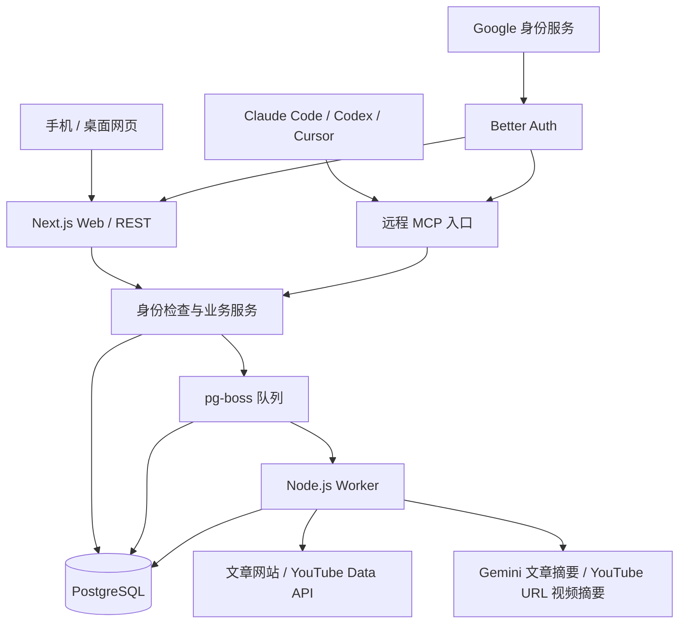
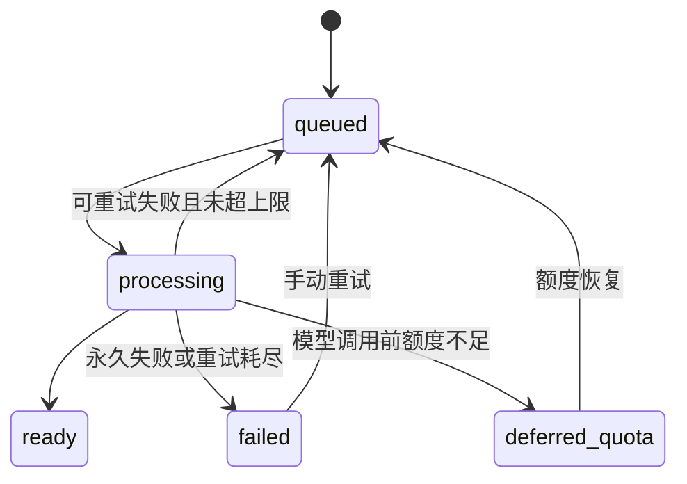

# Sharing — 第一版技术设计

> 2026-09-29 更新：YouTube Worker 改为直接 URL、Gemini 非流式一次调用，长视频降低画面采样；新迁移记录缓存用量，旧音频摘要和历史计量保留。当前实现及验收边界见 [视频 Worker](./YOUTUBE_AUDIO_WORKER.md)。

版本：v0.5

日期：2026-09-29（UTC）

状态：文章和 YouTube URL 非流式视频摘要设计已实现；URL 实现基线 `f9cd079` 已推送 GitHub main，生产镜像升级仍待执行

需求依据：[产品需求文档](./PRD.md)  
实施顺序：[开发计划与私有分发](./DEVELOPMENT_PLAN.md)  
工程约定：[开发指南](./DEVELOPMENT.md)

S1 实现注记：依赖已锁定，采用 Better Auth/MCP 1.7.6、官方 MCP SDK 2.1.0；Google 登录与 Codex DCR OAuth 已实测。连接通过服务端扩展声明 `sharing_grant` 绑定独立 OAuth 授权，所有 MCP 请求实时检查此记录。撤销后可在同一网页登录会话中再次确认授权，无需退出登录。旧访问和刷新凭据保持失效；MCP 返回标准 401 认证挑战，刷新失败返回 invalid_grant。用户已确认 Codex 显示重连提示，点击后打开 Sharing 网页；其他客户端仍待分别验证。首次连接重置后独立 CLI 查询尚为 notLoggedIn，最新证据边界见 [兼容性记录](./validation/COMPATIBILITY.md)。业务事件使用毫秒精度 timestamptz，认证表保留官方生成结构。S1 的任务表为 content_tasks，只有 process_content 排队入口；A1 已补齐处理尝试、计量、额度预留、设置和审计存储，保留 content_tasks/idempotency_keys 等 S1 表名；A4 已接入 Gemini 与 YouTube 实际调用；[A4 真实服务验收](./validation/A4_REAL_SERVICES.md)保留早期元数据证据，旧音频验收见 [历史记录](./validation/YOUTUBE_AUDIO_GEMINI.md)，当前 URL 流程见 [视频 Worker](./YOUTUBE_AUDIO_WORKER.md)。

本文是完整产品目标设计。当前 S1 实际字段、路由和 scope 与目标的差异集中记录于 [可执行契约](./validation/CONTRACTS.md#当前接口与完整设计的差异)，不要把下面尚未实现的目标接口当成已上线 API。

## 1. 设计结论与边界

采用 TypeScript、Next.js、PostgreSQL、Drizzle、Better Auth、pg-boss 和官方 MCP TypeScript SDK。一个应用代码仓库，部署为 Web 与 Worker 两个进程，共用数据库和业务模块。Plugin 源文件在同一应用仓库维护，发布产物导出至单独的私有分发仓库。

网页是分享入口，远程 MCP 是 Agent 入口。两者共用身份映射、成员检查和业务服务。链接保存与内容处理解耦；已保存的分享不因抓取、模型或视频 API 失败而丢失。

本设计沿用 PRD 的范围：单共享空间、无原文归档、无视频分析、无平台聊天、无向量检索。文中技术默认值作为首版实施起点，可根据验证结果调整，不代表测得的性能或可用性保证。

### 1.1 选型与未决事项

| 部分 | 设计选择 | 说明 |
| --- | --- | --- |
| 语言与运行环境 | TypeScript，Node.js 24，pnpm 11 | 已锁定版本与 lockfile，详见兼容性记录 |
| 网页 | Next.js App Router、React、Tailwind CSS | 手机优先；界面英文 |
| 应用后端 | Next.js Route Handlers，Node.js runtime | REST 与 MCP 为薄入口，业务逻辑独立 |
| 数据 | PostgreSQL、Drizzle | 事务、唯一约束、迁移；不引入 Redis 或对象存储作为前置依赖 |
| 身份 | Better Auth + Google | 数据库会话、已验证公司邮箱、首次登录自动建档 |
| Agent 授权 | OAuth 授权码 + PKCE | 已采用 Better Auth MCP/OAuth 1.7.6；本地 Codex DCR 通过，其他客户端待验收 |
| MCP | 官方 TypeScript SDK 2.1.0，远程 HTTP | SDK legacy 与 2026-07-28 pinned 路径通过；不代替三个产品客户端验收 |
| 异步任务 | pg-boss + 独立 Worker | 队列使用同一 PostgreSQL；应用保留可查询的处理状态 |
| 文章提取 | 安全 HTTP 抓取 + Readability + 不执行脚本的 DOM 解析 | 首版不默认运行浏览器渲染；依据真实样本决定是否增加抓取服务 |
| YouTube | YouTube Data API + Gemini YouTube URL + 嵌入播放器 | 作者描述原样保存，URL 经一次非流式模型调用生成独立摘要 |
| 模型 | Gemini 3.5 Flash-Lite、薄适配器 | 文章使用文本输入；视频使用 YouTube URL 非流式一次调用，短/长视频已真实隔离验证 |
| 测试 | Vitest、真实 PostgreSQL 集成测试、Playwright | 验证权限、事务、队列恢复和关键用户流程 |
| 部署 | AWS Lightsail + Docker Compose | Caddy、Web、Worker、PostgreSQL；域名 sharing.authright.com，视频版本升级步骤见部署指南 |

Next.js 支持 Node.js 和 Docker 部署；pg-boss 使用 PostgreSQL 并提供事务入队、并发和重试能力。两者适合此处的独立 Worker 架构。[Next.js 部署](https://nextjs.org/docs/pages/getting-started/deploying)、[pg-boss](https://github.com/timgit/pg-boss)

## 2. 系统结构

- **Web 进程**：页面、认证回调、OAuth 端点、REST、MCP 和健康检查。
- **Worker 进程**：文章处理、视频摘要与预览、重试、过期任务恢复、视频缓存维护。
- **共享业务层**：用户身份、成员检查、链接规则、分享与查询、撤回、用量和额度。
- **数据库**：业务数据、Better Auth 数据、pg-boss 队列数据；一般业务不直接修改认证库或队列内部表。OAuth 连接撤权在认证边界模块中清理对应刷新链和 consent，由集成测试约束；升级认证库时复核这些耦合点。

查询仅访问已保存的数据；查询与详情接口不触发模型或正文抓取。暂不需要额外的通用后端框架或独立 MCP 部署。

## 3. 身份与权限

### 3.1 Google 登录与成员绑定

1. 浏览器通过 Better Auth 发起 Google 登录，只请求身份所需的 `openid`、`email`、`profile`。
2. 由 Google provider 验证身份响应；应用检查可信响应中的 `email_verified=true` 和精确 `@authright.com` 邮箱域名。不配置 Google provider 的 `hd`（当前库会将其作为额外准入限制）；不接受客户端自填身份。
3. 已绑定用户通过稳定的 Google account ID / subject 映射平台 `user.id`。首次会话创建时锁定用户记录，自动建立普通成员，重复/并发登录不重复建档；旧 bootstrap 记录保留管理员角色。
4. 姓名、邮箱更新不改变历史归属。旧 `disabled` 标记不再限制访问，登录时归一为 active；已撤销 Agent 连接不会因此恢复。
5. 通过检查后建立数据库会话。Cookie 使用生产 HTTPS、安全属性和认证库推荐配置；初始关闭 session cookie cache。

网页登录失败展示 `/auth-error` 恢复页，提供重试和返回入口，不直接展示认证库 JSON。只对交互式认证页面导航适配；API、Token 交换及 MCP 保留机器可读错误响应。成员管理不显示当前管理员自己的角色切换按钮，其他角色操作仍由服务端权限及最后管理员规则约束。

Better Auth 的 Google provider 和数据库会话能力是实现基础；指定版本的域名校验路径、登录钩子与撤销行为仍需测试。[Google provider](https://better-auth.com/docs/authentication/google)、[会话管理](https://better-auth.com/docs/concepts/session-management)

不再预录允许名单。首次管理员由可重复执行的 bootstrap 命令配置指定邮箱；其未登录记录可暂时保留空 `user_id`，不影响其他公司用户登录。普通首次登录不自动成为管理员；保护最后一个已绑定公司管理员。

### 3.2 每次业务访问的统一检查

业务入口构造可信 `Actor`：`userId`、认证方式、授权 scope、授权记录 ID。请求里的 `userId`、邮箱或姓名不能决定分享者身份。

统一顺序为：验证凭据 → 查询当前用户已验证公司邮箱 → 检查操作权限 → 执行业务。Next.js 页面跳转和前端隐藏按钮不代替服务端校验。

| 操作 | 活跃成员 | 管理员 | 额外条件 |
| --- | --- | --- | --- |
| 分享、查询、详情、成员检索 | 可以 | 可以 | MCP 还需对应 scope |
| 撤回 | 可以 | 可以 | 仅本人分享；管理员也不默认获得代撤回权限 |
| 手动重试 | 可以 | 可以 | 本人存在该内容的有效分享，且内容失败；遵守并发和重试冷却 |
| 维护成员、查看用量、调整额度 | 不可以 | 可以 | 首版仅通过网页管理接口 |

不提供平台成员禁用或移除准入功能。每次请求检查数据库中的已验证公司邮箱，若资料变为其他域名则拒绝；这不是实时查询 Google Directory，也不承诺 Google 账号停用后立即撤销已签发的本地会话。个人 Agent 连接仍可独立撤销，历史分享保留。

### 3.3 MCP OAuth

Google 是上游登录服务；Sharing 是 Agent 的授权服务和受保护资源。Google Token、网页 Cookie、平台 MCP Access Token 不能互换。

授权身份取自点击 Allow access 时的 Sharing 网页会话，不取自 Codex 登录邮箱。Sharing 保留邮箱、姓名、内部 user ID 与授权记录；客户端持有 Sharing OAuth 凭据，不因此获得 Google 凭据或 Gmail 邮件权限。网页后来切换账号不会改变已签发连接的身份；切换连接身份需要在目标账号下重新授权。

- 使用授权码流程与 PKCE S256，显示登录页与授权确认页。
- 发布授权服务器元数据和受保护资源元数据；未认证 MCP 请求返回标准认证挑战。
- 定义 `shares:read`、`shares:write`、`members:read`；撤回属于写权限，但仍检查记录归属。
- 验证 Token 的签名或内省结果、issuer、audience/resource、到期时间、scope。
- 维护平台授权记录，将可验证 Token 的授权标识关联 `agent_grants`；每次请求检查未撤销、用户匹配。只验 JWT 签名不能满足单个授权立即撤销。
- S1 已通过 provider 的可信 claims hook 写入 `sharing_grant`；新授权用授权码哈希关联连接，刷新只复用该授权对应的连接。不得通过“选择最新有效连接”恢复旧凭据。
- OAuth 客户端元数据抓取必须使用插件提供的安全传输或等效实现，防止内部地址访问；严格校验 redirect URI、state 和 PKCE。
- 具体选择 CIMD、预注册客户端或必要的 DCR 兼容路径，以三种客户端实测为准。不假定最新插件的默认协议能被所有客户端接受。

官方 Better Auth MCP 插件构建在 OAuth Provider 之上；它负责认证相关协议，业务工具仍由 MCP SDK 与应用实现。采用它时按锁定版本文档组合插件，不重复注册两个 OAuth Provider。[Better Auth MCP](https://better-auth.com/docs/plugins/mcp)

首版以 OAuth 为目标，不同时开发个人 Token 管理。若 S1 发现不兼容，先记录具体版本和失败环节，调整插件/SDK 组合或客户端注册方式；不能用匿名 MCP 替代验收。

## 4. 数据模型

业务主键使用 UUID，外键到 Better Auth 用户时沿用其 ID 类型。所有事件时间使用 PostgreSQL `timestamptz`，以 UTC 保存。下表是逻辑模型，具体迁移以锁定依赖版本的 schema 为准。

| 实体 | 主要字段与约束 |
| --- | --- |
| Better Auth 表 | `user`、`account`、`session`、验证与 OAuth 插件所需表，由认证库生成并经迁移管理 |
| `members` | `id`、`user_id`（可空且唯一）、旧 `allowed_email`（初始身份/bootstrap 邮箱）、旧 `status`（兼容存储，不作准入）、`role=member/admin`、`timezone`、创建/更新时间 |
| `contents` | `id`、`type=article/youtube`、`dedupe_key`（唯一）、`first_original_url`、`normalized_url`、`video_id`、标题、作者/频道、封面 URL、摘要概述、摘要要点 JSON、视频描述、状态、失败码、模型与 prompt 版本、生成/元数据获取/过期时间 |
| `shares` | `id`、`content_id`、`user_id`、`original_url`（每次实际提交的链接）、`created_at`、`withdrawn_at`（可空） |
| `idempotency_requests` | `user_id`、`operation`、`key`、请求摘要、结果记录 ID；前三者联合唯一 |
| `processing_tasks` | `id`、`content_id`、`kind=article_summary/youtube_preview/youtube_refresh`、`generation`、状态、队列 job ID、尝试次数、错误码、租约/开始/结束时间、重试冷却截止时间 |
| `processing_attempts` | `id`、`task_id`、`attempt_no`、阶段、请求标识、开始/结束时间、结果；一次任务尝试的阶段与结果，不存正文或音频笔记；各次模型调用由 usage_events 分别追踪 |
| `usage_events` | `id`、attempt ID、服务/模型、供应商请求 ID、输入/输出 Token、调用状态、估算金额、币种、价格版本、计价时间、`usage_known`、nullable `usage_details`（缓存及模态 token）、nullable 缓存输入单价 |
| `quota_reservations` | `id`、attempt ID（唯一）、UTC 计费月份、模型调用单位、状态；用于并发安全的调用次数限制 |
| `settings` | 单行配置：额度开关、月调用上限、默认时间窗口、分页大小；带版本号防止管理员并发覆盖 |
| `agent_grants` | `id`、`user_id`、OAuth client 标识、库中授权关联标识、scope、创建时间、撤销时间；不复制明文 Token |
| `audit_events` | 管理员/用户 ID、成员变更或撤权或设置变更、目标 ID、时间、脱敏前后值；不记录来源正文或凭据 |

约束与索引：

- 内容按 `dedupe_key` 唯一；YouTube 的 key 为视频 ID，文章为保守规范 URL 的摘要。
- 同一用户可主动重复分享；不对 `(user_id, content_id)` 加唯一约束。
- 内容和任务状态校验；同一内容同一种处理类型最多一个非终态任务，使用部分唯一索引并结合事务锁。
- 用量事件对 `(attempt_id, service, invocation_index)` 加唯一约束；收到重复回调或恢复写入时更新已有事件，不重复累计用量。
- 查询使用有效分享的 `(created_at DESC, id DESC)` 及 `(user_id, created_at DESC, id DESC)` 索引。
- 内容摘要、描述和原始链接是不同字段；`source` 由数据类型与实际可用字段推导，不依赖前端猜测。
- 首版对标题、摘要和视频描述使用转义后的参数化 `ILIKE` 子串查询；暂不做语义搜索。出现实际性能问题后再评估 trigram 索引。

## 5. 分享、去重与任务一致性

### 5.1 链接规则

接受长度不超过 8 KiB 的 HTTP/HTTPS URL，不接受用户名密码、内部地址或非 Web 协议。YouTube 只识别明确域名及 `watch`、短链、`shorts`、`embed` 等视频路径；频道/播放列表且无视频 ID 时提示提交具体视频链接。

文章规范化使用标准 URL 解析：主机名和协议规范化、默认端口归一、空路径归一；保留路径大小写、查询参数顺序和值及可能改变内容的 fragment，不主动合并 HTTP/HTTPS。首版宁可少合并，不误合并不同文章。页面 canonical 标签和重定向目标只作为元数据，不无条件替换去重 key。

每条分享始终保留它自己的原始 URL；复用内容不会丢失某位分享者提供的链接。

### 5.2 保存事务

1. 验证成员、输入及幂等 key。UI 为每次主动提交生成新 UUID，网络重试复用；MCP 支持可选 key 并在工具说明中要求重试复用。
2. 开始事务，按 `(user, operation, key)` 锁定或创建幂等记录；同 key 同请求返回原记录，不同请求返回冲突。
3. 按去重 key upsert 内容并锁定内容行，插入分享记录。
4. 新内容若无活跃任务，在同一个数据库事务中创建处理任务并通过 pg-boss 的事务适配器入队。
5. 提交后返回 `201` 与分享 ID、`share_status=shared`、内容处理状态。幂等重放返回既有结果与 `replayed=true`。

成功内容直接复用；处理中/额度暂停内容复用任务；失败内容被再次分享时保留失败状态，由显式重试触发处理，避免每次分享隐式重复付费。

pg-boss 入队必须验证真正复用了当前事务连接。若选定版本无法做到，改为同事务写入 outbox，再由幂等 dispatcher 入队；禁止“分享已提交但任务永远未入队”的双写窗口。数据库不可用时返回未保存，不能显示 `Shared`。

缺少幂等 key 的调用不能可靠区分网络重试与主动重复分享，不承诺此情况下自动去重。客户端断线后的写操作必须使用原 key 重试。首版幂等映射随分享记录保留，不提前过期而产生迟到重试的重复记录。

### 5.3 Worker 状态与恢复

`contents.processing_status`：`queued`、`processing`、`ready`、`failed`、`deferred_quota`。任务另有 `retry_wait`、`cancelled`、`succeeded` 等内部状态。

- pg-boss 负责交付与重试，应用任务负责产品状态；不再实现第二套竞争消费队列。
- 每次领取任务生成 attempt ID 与租约；更新结果时校验任务 generation/租约，拒绝过期 Worker 覆盖新结果。
- 初始单 Worker，总内容处理并发 2，其中模型调用并发 1；可配置。视频非流式请求期限 600 秒，文章请求 90 秒；单次任务总期限 900 秒、租约 960 秒、队列期限 1020 秒。长视频或时长未知使用 0.1 fps，不下载/上传音轨。
- 模型调用前标记为可重试的抓取错误交给 pg-boss，最多 3 次尝试（含首次）。模型请求发出后均不自动重跑，包括 Gemini 429/503、视频不可访问或结果未知；保留错误和用量供手动重试。
- 手动重试重建 generation，允许失败内容或尚无视频摘要的历史 ready 视频，受活跃任务检查和 60 秒冷却限制；并发重试合并到一个任务。已有成功摘要不提供重新生成按钮。
- Worker 周期性对账过期租约、异常任务与队列终态，保证状态不会永久停在处理中；停止时停止领取并给在途任务有限完成时间。
- 内容已无有效分享且外部调用尚未开始时，可取消任务；已经开始的外部调用可能产生费用，但不会恢复撤回的分享。

数据库事务不能与第三方模型调用形成一个原子操作。正常并发和后续分享应只生成一次；若模型已完成但进程在保存前崩溃，可能出现不确定结果。供应商支持幂等时复用 attempt key；无法确认是否执行时标记 `outcome_unknown`，不自动重发付费请求，允许用户知情重试。不能宣称跨系统严格 exactly-once。

## 6. 内容处理

### 6.1 文章

处理顺序：安全抓取 → HTML/元数据解析 → Readability 提取 → 可用性检查 → 额度预留 → 模型摘要 → schema 校验 → 保存摘要与用量。

- 抓取总超时初始 20 秒、最多 5 次重定向、解压后最大 5 MiB；超限明确失败。只处理可支持的 HTML，不把 PDF/二进制交给 HTML 解析器。
- 每一跳解析并校验 IPv4/IPv6 地址，拒绝回环、私网、链路本地、云元数据等非公网目标；实际连接固定使用已检查 IP，保留正确 Host/TLS，避免 DNS 重绑定。禁用环境代理等可绕过检查的隐式路径。
- 不带用户 Cookie、不模拟登录；DOM 解析不执行脚本、不加载子资源。预览图不经过通用服务器图片代理，避免另一条任意 URL 抓取路径。
- 正文检查包括付费/登录提示、主体密度、异常截断和抽取结果。长度只是辅助信号，不能证明完整性；测试覆盖短但完整文章及很长的登录/广告页面。
- 明显不完整、不可靠或超过模型输入上限的正文返回失败，不只截取前半篇却声称是完整文章摘要。
- 模型只接收正文与必要标题，正文作为不可信数据；禁用工具调用，不让来源文字改变任务。输出英文 `overview` 和 3–5 个 `key_points`，用 Zod 校验结构和长度。原始链接由服务端附加，不要求模型编造链接。
- 保存模型标识、prompt 版本、生成时间及可获得用量；仅在成功校验后将内容标记 ready。
- 正文只存在当前 attempt 的内存；finally 释放引用，不写任务 payload、数据库、日志、异常追踪或临时永久文件。失败重试重新抓取。

Readability 是正文提取器，不保证所有网页可提取；提取服务是否需要升级由真实样本决定。[Readability](https://github.com/mozilla/readability)

### 6.2 YouTube

处理顺序：YouTube 元数据 → 原子预留一次模型调用 → 规范 YouTube URL 直接传给 Gemini `generateContent` → 校验完整 STOP、可访问标识和摘要 schema → 保存最终摘要。模型结合语音及采样画面，长视频降低 fps；不传标题/描述冒充视频依据，不比对音视频时长，不要求时间戳。新摘要使用 `youtube-url-en-v1`，历史音频摘要保留旧版本和来源说明。参数、限制与部署见 [视频 Worker](./YOUTUBE_AUDIO_WORKER.md)。

新 Worker 不读取音轨工具路径或下载代理；Dockerfile/Compose 已删除相关安装与配置。历史 `youtube-audio.ts`、`gemini-files.ts`、音频提取 adapter、诊断脚本和测试仍保留供旧流程排查，不参与当前 Worker 处理。已生成的音频摘要及计量记录按原版本继续读取，不因代码发布转换来源。运行配置与历史文件的保留范围见 [范围表](./YOUTUBE_AUDIO_WORKER.md#旧配置的移除范围)。

通过 `videos.list` 请求 `snippet,contentDetails,status`，保存可取得的标题、频道、封面 URL、Description、时长和嵌入状态。API Key 仅在 Worker，API 无结果或不可访问时保留原链接并标记预览失败。[YouTube videos.list](https://developers.google.com/youtube/v3/docs/videos/list)

Description 允许为空，非空时按原语言保存为纯文本。链接展示需限制安全协议；不执行其中 HTML。页面明确标注 `Video description`，提供播放器和始终可见的 `Watch on YouTube`。API 的可嵌入标识只是提示，播放器运行时错误也要回退到链接。

YouTube API 对存储的数据有刷新/删除要求。设计在获取后第 29 天安排元数据刷新，第 30 天前若仍未刷新成功则清除 API 派生标题、描述、封面、时长等缓存；后台清理任务和读取时的过期过滤双重保证。用户提交的链接、解析出的 video ID 和分享历史独立保留。已无有效分享的内容直接清理缓存即可。这是 API 缓存维护，不构成失效恢复服务，不触发 LLM。[YouTube API 数据存储政策](https://developers.google.com/youtube/terms/developer-policies)

刷新失败但未到过期时间可继续展示原缓存并记录刷新状态；到期清除 API 元数据，但保留已生成的视频摘要及其搜索能力，不把过期描述返回给 Agent。元数据缺失时仍可安排刷新；刷新不调用模型，也不将摘要失败标记为成功。备份恢复后先执行过期清理再对外服务，避免重新提供过期缓存。

## 7. REST 与 MCP 契约

### 7.1 业务 REST API

| 方法与路径 | 功能 | 关键输入 |
| --- | --- | --- |
| `POST /api/shares` | 提交 | `url`，`Idempotency-Key` |
| `GET /api/shares` | 查询 | `sharer_id`、`from`、`to`、`query`、`limit`、`cursor` |
| `GET /api/shares/:id` | 详情 | 分享 ID |
| `DELETE /api/shares/:id` | 撤回本人分享 | 分享 ID；重复撤回返回成功 |
| `POST /api/shares/:id/retry` | 重试失败内容 | 本人有效分享 ID，幂等 key |
| `GET /api/members` | 消歧检索 | 姓名/邮箱关键词、分页；只返回必要资料 |
| `GET /api/account/connections` | 查看自己的 Agent 授权 | 分页 |
| `DELETE /api/account/connections/:id` | 撤销自己的授权 | 授权 ID |
| `GET /api/admin/members` | 查看已登录成员 | 邮箱查询、分页；不展示待绑定 bootstrap 记录 |
| `PATCH /api/admin/members/:id` | 修改成员角色 | 成员 ID、role；拒绝 status 字段，保护最后管理员 |

认证库挂载于 `/api/auth/*`；OAuth discovery 依库要求映射正确 well-known 路径；MCP 固定于 `/mcp`。不手写替代 OAuth 协议。

业务错误包含稳定 code、英文 message、request ID；无凭据 401，无成员/操作权限 403，不存在或已撤回详情 404，幂等冲突 409，参数错误 400，技术限流 429。HTTP 成功保存与内容处理失败是两个维度。API/页面不公开堆栈和供应商原始错误正文。

### 7.2 查询语义

- 查询实体是分享记录，因此不同人的同一内容返回多条，可共享 `content_id`。
- 没有时间参数：`to=本次查询时间`，`from=to-7×24小时`；只给 from 时 to=当前时间，只给 to 时 from=to-7×24小时。范围采用 `[from,to)`。
- 明确时间必须为带时区的 ISO 8601；拒绝无时区值、非法区间，不由服务端猜测“这周”。网页/Agent 按用户 IANA 时区转换日历边界；工具返回实际范围。
- 默认 limit 20，最大 100。按 `(created_at DESC,id DESC)` 游标分页，游标保存初始时间范围、筛选摘要及末条位置并签名；筛选变化重开分页。
- 查询只包含未撤回记录。删除会使后续页少一条，新增不会挤入固定 to 之后的结果。
- 查询成员的 active 由已验证公司邮箱推导；保留有历史分享但已不符合域名资格的账号用于历史检索，不返回管理审计信息。

### 7.3 MCP 工具

| 工具 | 参数 | Scope | 结果 |
| --- | --- | --- | --- |
| `share_link` | `url`、可选 `idempotency_key` | `shares:write` | 分享 ID、保存与处理状态 |
| `list_shares` | 与 REST 查询字段一致 | `shares:read` | 精简列表、实际范围、下一页游标 |
| `get_share` | `share_id` | `shares:read` | 完整已保存摘要或描述 |
| `list_members` | `query`、`limit`、`cursor` | `members:read` | 成员 ID、姓名、邮箱、活跃状态 |
| `withdraw_share` | `share_id` | `shares:write` | 撤回结果 |

手动重试与管理功能先放网页，不新增模型分析工具。列表优先返回文章或视频摘要概述，无视频摘要时返回有效作者描述短摘录，初始最多 500 字符，并携带 `truncated`；详情返回已保存的全部摘要/描述。列表不把长描述塞入每条结果。

统一分享 DTO 必须含：`share_id`、`content_id`、`sharer`、`shared_at`、`type`、`title`（可空）、`original_url`、`normalized_url`、`processing_status`、`source`、`full_content_available:false`、`content_scope_note`。

- 文章成功：`source=ai_article_summary`、`article_summary={overview,key_points}`。
- 视频摘要成功：`source=ai_video_summary`、`video_summary={overview,key_points}`；新摘要注明语音及采样画面，历史音频摘要保留旧来源说明；`article_summary=null`。
- 无视频摘要但作者描述缓存有效：`source=youtube_description`、`video_description`，空字符串描述仍使用此来源。
- 尚无摘要及有效描述：`source=none`。历史描述型 ready 视频保留兼容；新视频须摘要完成才标记 ready。
- 保留必要错误码与可重试标识；不要把“没有全文”理解为“摘要处理失败”。

使用 SDK 的结构化结果和对应 schema；必要的文本回退由同一 DTO 序列化，避免两套不一致结果。描述和摘要作为来源数据标注，不成为工具指令。读工具声明只读，撤回声明破坏性操作；这些 annotations 不代替服务端权限验证。

## 8. 网页与状态展示

### 配色主题

Sharing 与本地 `vote` 项目当前的 **Light systems** 主题保持一致。主题统一定义在 `src/app/globals.css`，覆盖登录、分享列表、账户和授权页面；保留现有布局、间距、字体与响应式断点。

| 用途 | 颜色 |
| --- | --- |
| 页面底色 / 卡片 | `#f3f6f9` / `#ffffff` |
| 主文字 / 次要文字 | `#20344f` / `#60738d` |
| 主按钮 / 悬停 | `#3267b1` / `#25569b` |
| 分隔线 / 输入边框 | `#d9e3ef` / `#bdd0e5` |
| 浅蓝标签背景 / 边框 | `#e9f2fd` / `#c7dcf5` |
| 键盘焦点 / 错误文字 | `#7aa9ed` / `#9c3942` |

沿用 vote 的淡蓝径向背景与轻量卡片阴影。输入提示使用次要文字色，保持小字号可读性；交互状态只改变颜色和阴影，不移动元素。

### 页面与业务状态

| 页面 | 内容 |
| --- | --- |
| `/sign-in` | Google 登录与无访问权限提示 |
| `/` | 链接输入、提交按钮、最新 5 条分享、查看全部入口 |
| `/library` | 全部历史分享，按人/时间/关键词筛选；时间倒序，每批 10 条滚动加载 |
| `/shares/:id` | 分享者、时间、来源、完整摘要或描述、原文/视频链接、本人撤回及失败重试 |
| `/account` | 当前身份、时区、Agent 接入说明、已授权连接与撤销 |
| `/consent` | Agent 身份和请求权限，允许/拒绝授权 |
| `/admin` | 已登录成员名单与角色管理；不新增审计、用量或额度设置页面 |

提交成功立即显示 `Shared`；摘要和预览状态单独展示。初始每 3 秒轮询页面内待处理记录，离开页面或全部终态后停止；不引入 WebSocket。

状态英文沿用 PRD；`deferred_quota` 增加 `Summary paused — usage limit reached`，链接仍可打开。区分空列表、无搜索结果、无成员权限、处理失败。所有写操作有等待和重复点击处理，手机可用触控和键盘操作。

Library 的首批 10 条服务端渲染；客户端通过 IntersectionObserver 在接近底部时调用带签名游标的分享接口，保留手动加载按钮供键盘操作与无 observer 环境使用。每次仅一个分页请求；失败保留现有结果并允许重试，游标过期提示重新加载。筛选 URL 改变时重置列表并取消旧请求，按 share ID 去重。处理状态更新直接合并已加载卡片，不因整页刷新丢掉累积的历史页。

网页通过显式 `from=0001-01-01T00:00:00.000Z` 查询产品的全部日历历史，首页 limit=5、Library limit=10；后续游标固定初始上界、筛选条件和批大小。底层 REST/MCP 未指定范围时仍默认最近 7 天，不改变现有客户端契约。

## 9. 用量、额度与技术限流

当前 Gemini API 项目使用 Free tier，已知输入/输出按配置记录零估算费用。主要供应商约束为项目和模型的 RPM、输入 TPM、RPD，以 AI Studio 为准；应用 UTC 月度额度不能替代它们。可选产品额度仍默认关闭，统计文章及视频实际模型调用次数；自动/手动重试的实际调用均计入。模型请求前失败、元数据刷新、读取和摘要复用不消耗模型调用额度。每个新视频为一次调用，历史两次音频调用不改写。

Worker 在模型请求前通过事务锁检查已消耗与已预留单位；文章和视频均预留 1 单位。新视频写入 `video_summary`、`invocation_index=1`，旧 `audio_extract` / `summary` 保留。未发送部分释放，已发出但未知结果保守计量；完整但不可访问/摘要无效的响应保留已知用量。`usage_details` 保存白名单缓存和输入模态计数，`cached_input_price_per_million` 保存价格快照；费用估算按缓存与非缓存输入分别计算，缺用量或对应价格时留空。

产品月额度超额任务进入 `deferred_quota`；月切换、提高额度或关闭额度时，由幂等扫描器重新入队。当前 Gemini 429 按处理失败记录，分享链接保留，额度恢复后用户可手动重试。试用中若频繁触发，再实现供应商 RPM/TPM/RPD 的并发安全预留、等待窗口及幂等自动恢复；此增强不需要新增管理页面。

Token 和请求数作为主要可观察用量单独记录。未知用量用 null 和 `usage_known=false`，不能记成零。已知 Free tier 文本调用的单价快照和估算金额为零；Paid tier 才按其价格快照估算，历史上按 Paid 价格写入的 A4 测试事件明确标作“付费档等价估算”，不当作实际账单。切换档位需要显式修改 `GEMINI_BILLING_TIER` 并检查 AI Studio；不自动启用付费。YouTube、托管与数据库费用另算。

技术保护与产品额度分离：设置每用户写接口/重试的速率限制、任务并发、输入大小和超时。具体限流数值在试用前按样本确定，不能把“产品额度关闭”实现成无限请求。

## 10. 部署、运维与数据生命周期

- 同一版本构建 Web 和 Worker，各自启动；Worker 为持续运行服务，不依赖请求结束后的后台回调。
- 本轮 URL Worker 基线 [f9cd079](https://github.com/TAO44123/Authright_Sharing/commit/f9cd079eb22cc2cedd15c67fb33dafdf10a5c02c) 已推送 GitHub；本地已应用 `0004`，最近确认的生产镜像仍为 `sharing:cdca1f0`。生产更新须从 GitHub 拉取、构建、备份、停旧服务、迁移再启动新镜像；独立 API 探测不等于生产队列验收。
- 生产、测试的数据库和 OAuth 凭据隔离；Google redirect URI、Better Auth base URL、MCP resource 均由正式域名配置。
- 模型与 YouTube Key 只给 Worker；认证 Secret 只给需要签发/验证凭据的服务。客户端 bundle 不含密钥。
- 迁移作为单独发布步骤运行一次；应用采用兼容旧版本的增量 schema 变更，先迁移再发服务。失败时回滚应用镜像，不盲目反向迁移数据。
- 数据库有自动备份并实际演练恢复；选定平台后补齐保留期与恢复目标。恢复后先执行授权/缓存/任务对账，不直接暴露旧状态。
- `/health/live` 检查进程存活，`/health/ready` 检查必要数据库连接；Worker 记录心跳和最近成功领取任务时间。
- 日志仅含 request/task/attempt ID、阶段、时长、结果和脱敏错误码。屏蔽 Authorization、Cookie、Google/模型凭据、完整 URL 查询参数、正文和模型原始输入输出。
- 监测任务积压、最长等待、失败率、未知调用结果、授权失败、Gemini RPM/TPM/RPD 剩余额度；Paid tier 才重点监测费用估算。日志错误与后台处理错误可按 ID 关联。
- 私有页面及数据 API 设置 private/no-store，避免 Next.js/CDN 共享缓存跨用户返回数据。业务写接口检查同源和 CSRF，遵循认证库推荐策略。
- 抓取返回内容只以转义文本渲染；外链使用安全协议与 `noopener`，敏感页面设置合理 CSP；YouTube frame 域名单独允许。
- 正文不落盘；队列和业务任务载荷只有 ID/阶段。pg-boss 已完成任务可短期保留（初始 7 天）；运营日志初始 14 天并脱敏，必要错误统计长期保留聚合值。

### 10.1 Plugin 私有分发

第一版确定采用“部署服务 + 私有仓库分发”：集中运行 Web/MCP/Worker/数据库，客户端只安装远程连接配置、Skill、manifest 和必要资源。应用源与分发产物分开；私有分发仓库不包含后台源码、业务数据或秘密。

私有目录、安装路径、版本标签、兼容关系和升级/回退流程由 [开发计划](./DEVELOPMENT_PLAN.md) 第 7 节定义。仓库取包权限和 Sharing 数据访问权限独立；卸载 Plugin 不等于自动撤销 OAuth。三客户端的私有来源安装也需要真实验收，公开市场上架不在首版计划内。

## 11. 开发前验证与待配置事项

| 项目 | 当前结论 | 完成条件 |
| --- | --- | --- |
| Better Auth 网页登录 | 采用 | Google 已验证公司邮箱、自动建档与个人连接撤销由测试覆盖 |
| MCP OAuth 与 SDK | 已锁定 Better Auth 1.7.6 / SDK 2.1.0；本地 Codex 有成功证据 | 补齐清理后的 CLI 复验及三客户端完整记录 |
| pg-boss + Drizzle | 事务入队与回滚测试通过；S1 不消费任务 | A4 补齐 Worker 消费与崩溃恢复测试 |
| 文章提取 | Readability 起步 | 代表性来源样本有结果和失败分类 |
| 摘要模型 | Gemini 3.5 Flash-Lite 已接入；文章及 URL 短/长视频有真实结果 | 继续抽查质量和实际项目额度，不把样本成功当作所有来源保证 |
| YouTube API | 采用 | API 凭据可用，缓存维护及嵌入回退通过 |
| 托管环境 | AWS Lightsail + Docker Compose；sharing.authright.com，固定 IP 174.129.205.232 | 既有部署记录见部署手册；URL Worker 镜像升级和正常队列验收待执行 |
| 业务配置 | 本地 authright.com、测试管理员、Google 凭据已配置 | 公司用户自动加入；生产配置与正式产品名待确认 |

配置缺失不阻止 schema、业务测试和页面开发；不能用 mock 结果冒充真实登录、API 或客户端验收。与 PRD 范围发生冲突时先修订设计并明确记录，不通过实现悄悄改变产品。
